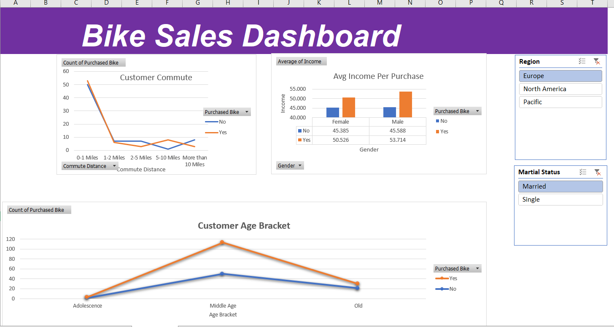

# 🚴‍♂️ Bike Sales Dashboard (Excel)

### 🎯 Objective
To explore customer purchasing patterns and identify key demographic factors affecting sales.

### 🧰 Tools & Techniques
- Excel (Pivot Tables, Slicers, Conditional Formatting)
- Data Cleaning (Text to Columns, Replace, Match)

### 📊 Process
1. Cleaned 1,000+ entries on buyer demographics and purchase behavior.  
2. Created pivot tables to analyze relations between **income, distance, and purchase frequency**.  
3. Designed interactive dashboards with **slicers and filters**.

### 💡 Insights
- Customers aged 30–45 had the highest average purchase amount.  
- Shorter travel distances correlated with higher purchase rates.

### 🏁 Outcome
An interactive dashboard that allows management to visualize and segment customer data efficiently.

### 📸 Screenshots

